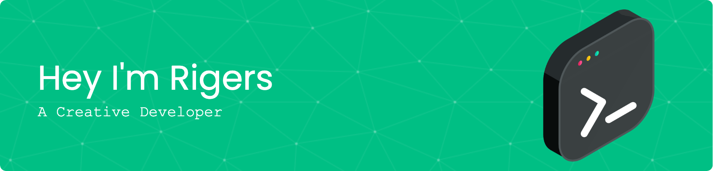

<h1 align="center">Hi 👋, I'm Rigers</h1>
<h3 align="center">A Creative Developer</h3>

  

  

- 🌱 I’m currently learning **React, Unity C# for Game Development and Swift for FUN!**

- 👨‍💻 All of my projects are available at [https://rigersdev.netlify.app/](https://rigersdev.netlify.app/)

- 📫 How to reach me **rigiuliu@gmail.com**

<h3 align="left">Connect with me:</h3>

<h3 align="left">Languages and Tools:</h3>

            

&nbsp;

